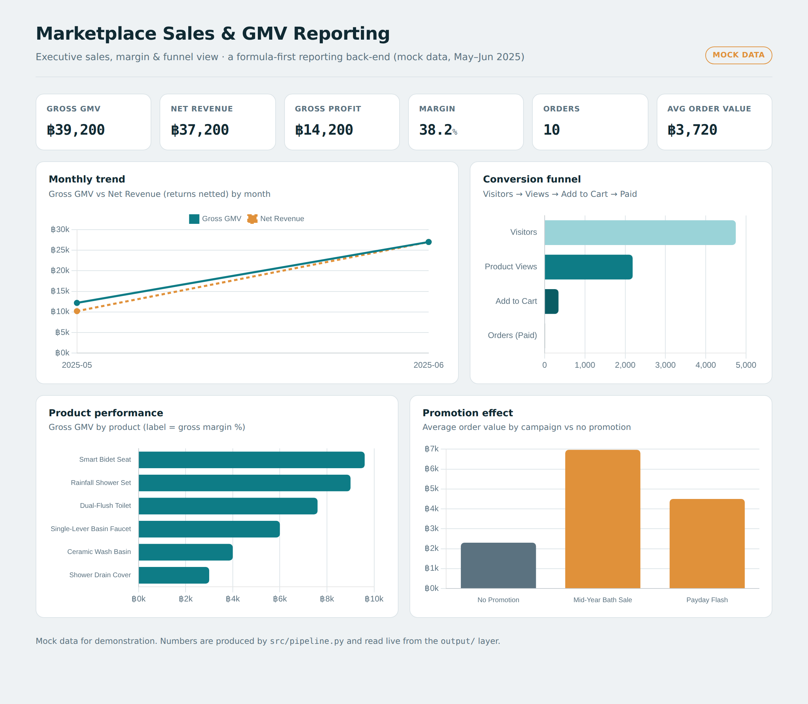

#### marketplace-sales-pipeline
# Marketplace Sales &amp; GMV Reporting Pipeline (May–Jun 2025)


> This mock project simulates an end-to-end **sales & GMV reporting back-end** for an online marketplace storefront — taking raw seller-center exports through a layered pipeline (`raw → clean → master → out`) and into an interactive dashboard.
> A formula-first data pipeline built for practice, demonstrating data engineering, auditable metric logic, and BI visualization.

### Why I Built this
I built this to demonstrate a **production-style reporting pipeline** end to end — not just a dashboard, but the auditable back-end behind it. The focus is on the parts that usually break in real marketplace reporting: getting the **order grain** right, making **returns net out correctly**, and keeping every number **traceable back to the raw export**.

โปรเจกต์นี้ทำขึ้นเพื่อจำลองระบบรายงานยอดขายของร้านค้าบนมาร์เก็ตเพลส แบบ end-to-end ตั้งแต่ไฟล์ดิบจาก seller center ผ่าน pipeline หลายชั้น (`raw → clean → master → out`) ไปจนถึง dashboard โดยเน้นจุดที่มักพลาดในงานจริง เช่น การจัดการ grain ระดับรายการสินค้า การหักลบยอดคืนสินค้าให้ถูกต้อง และการทำให้ทุกตัวเลขย้อนกลับไปตรวจสอบที่ไฟล์ดิบได้

This project let me show that I can:
- Design a **multi-source, layered pipeline** that joins four exports into one analysis-ready table
- Encode **metric logic that survives edge cases** — multi-item orders, cancellations, returns, internal exclusions
- Keep the whole thing **formula-first and back-trackable**, then ship it as a live dashboard

### Objective
- Report **GMV, Net Revenue, Gross Profit and Margin** from raw marketplace order data
- Handle real-world messiness: **multi-item orders, cancellations, returns/reversals, internal test orders**
- Surface **product performance, promotion effect, and the conversion funnel** in one view
- Make every metric **auditable** — traceable from dashboard number back to the raw row

### Architecture
Four marketplace-style exports + one internal list flow through a strict, linear pipeline:

```
 raw_   order_transaction · product_catalog · voucher_usage · traffic_funnel · exclusion_list (internal)
   │
 clean_ type + date · derive flags (canceled / excluded / sale) · line GMV
   │
master_ join catalog on sku  +  attach voucher on order  →  one analysis-ready table (+ margin)
   │
 out_   kpi_summary · monthly · product · promotion · funnel
   │
 dashboard  (Chart.js → GitHub Pages)        alt BI surfaces: Looker Studio · Power BI
```

The `raw_` exports are never edited by hand. Reporting flags are **derived in `clean_`**, and `is_excluded` comes from a **separate internal list** — so platform truth and internal business rules never get mixed into the raw data.

### Key Features

| Item | Description |
|------|---------------------------------------------|
| KPI Cards | Gross GMV / Net Revenue / Gross Profit / Margin / Orders / AOV *(ตัวเลขสรุปหลักของธุรกิจ)* |
| Monthly Trend | Gross GMV vs Net Revenue by month, returns netted *(แนวโน้มรายเดือน หักยอดคืนแล้ว)* |
| Product Performance | Gross GMV and gross margin % by product *(ยอดขายและมาร์จิ้นรายสินค้า)* |
| Promotion Effect | Average order value by campaign vs no promotion *(เปรียบเทียบ AOV ระหว่างมีและไม่มีโปรโมชั่น)* |
| Conversion Funnel | Visitors → Views → Add to Cart → Paid *(กรวยการแปลงผู้เข้าชมเป็นยอดขาย)* |

---
### Key Insights (Example Findings)
- **Net Revenue is ฿2,000 below Gross GMV** purely from one returned item netting to zero — the signed-sum logic catches this automatically, with no manual "minus returns" step.
- **Orders = 10, not 12** — a canceled order and an internal QA order are dropped by the counted/excluded flags; multi-item orders are deduped to a single order each.
- **Promotion orders carry a much higher AOV** (~฿6,967 on the Mid-Year Bath Sale vs ~฿2,300 with no promotion) — promotions here pull in larger baskets, not just more orders.
- **Margin varies widely by product** — from ~34% (Smart Bidet Seat) to ~50% (Shower Drain Cover) — so GMV and profit rankings are not the same list.
- ยอด Net Revenue ต่ำกว่า Gross GMV อยู่ ฿2,000 จากการคืนสินค้า 1 รายการที่ถูกหักลบอัตโนมัติ และจำนวนออเดอร์เหลือ 10 เพราะตัด order ที่ยกเลิกและ order ทดสอบภายในออก
> Note: all figures are produced by `src/pipeline.py` and cross-checked against an independent recompute from the raw file.

---
### Project Assets (View Only)
- Live Dashboard (GitHub Pages) 👉 `https://pinsuda-k.github.io/marketplace-sales-pipeline/`
- Formula crosswalk (Sheets ↔ pandas) 👉 [`docs/sheets_formula_crosswalk.md`](./docs/sheets_formula_crosswalk.md)

> This dataset is mock data created for practice. It simulates a small marketplace storefront across May–Jun 2025, with multi-item orders, a cancellation, a return + reversal, an internal test order, vouchers, and storefront traffic — chosen so the pipeline’s edge-case logic is visible.

---
### Tools Used
- **Python (pandas)** — the pipeline (`raw → clean → master → out`)
- **Google Sheets logic** — the original formula-first design (`ARRAYFORMULA`, `COUNTUNIQUEIFS`, `SUMIF`, `SUMIFS`), mapped 1:1 in the crosswalk
- **Chart.js + GitHub Pages** — the live dashboard
- *(also deliverable in Looker Studio / Power BI)*

---
### Data Sources (Mock)
| File | Grain | Feeds |
|------|-------|-------|
| `raw_order_transaction` | one row per order item | GMV, revenue, orders, units |
| `raw_product_catalog` | one row per sku | category, brand, cost → margin |
| `raw_voucher_usage` | one row per voucher redemption | promotion effect |
| `raw_traffic_funnel` | date × sku | conversion funnel |
| `exclusion_list` *(internal)* | one row per excluded order | business-rule filtering |

---
### Run it yourself
```bash
pip install pandas
python src/pipeline.py          # builds the clean_/master_/out_ layers in output/
python -m http.server           # then open http://localhost:8000 to view the dashboard
```

---
### Note on the data source &amp; automation (roadmap)
In a live setup, the raw layer is fed by **scheduled exports** from the marketplace seller center. The natural next step is **direct API ingestion** from the marketplace’s open platform — a scheduled pull that drops straight into the same `clean → master → out` layers, removing the manual export step and keeping the dashboard current without touching the metric logic. The pipeline is designed so the *source* of `raw_` can change while everything downstream stays identical.

*Mock data only. No client, brand, or platform data is used or represented in this repository.*
