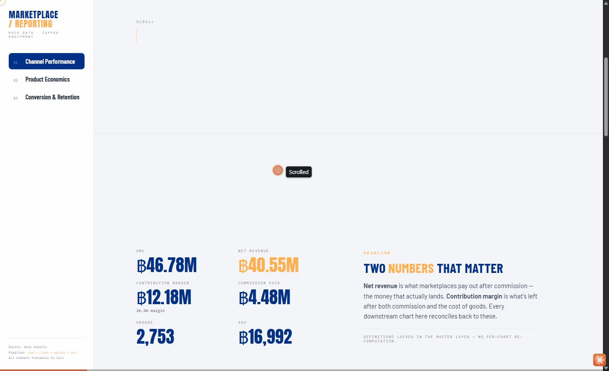

# Marketplace Sales & GMV Reporting Pipeline


> This project simulates a **formula-first sales &amp; GMV reporting back-end** for a specialty coffee equipment storefront selling across two marketplaces and its own DTC channel. Raw seller-center exports flow through a layered pipeline (`raw → clean → master → out`) into an interactive dashboard, with Sheets formulas and pandas kept as **1:1 equivalents so every number is auditable in either surface**.

## Why I built this

I wanted to demonstrate a **production-style reporting pipeline** end-to-end , not just a dashboard, but the auditable back-end behind it. The focus is on the parts that usually break in real marketplace reporting: getting the **order grain** right, making **returns net out correctly**, keeping every number **traceable back to the raw export**, and , the piece I care about most , showing that the same reporting logic can live in Google Sheets *or* in Python and produce identical numbers.

โปรเจกต์นี้ทำขึ้นเพื่อจำลองระบบรายงานยอดขายของร้านค้าบนมาร์เก็ตเพลส แบบ end-to-end ตั้งแต่ไฟล์ดิบจาก seller center ผ่าน pipeline หลายชั้น (`raw → clean → master → out`) ไปจนถึง dashboard โดยเน้นจุดที่มักพลาดในงานจริง เช่น การจัดการ grain ระดับรายการสินค้า การหักลบยอดคืนสินค้าให้ถูกต้อง และการทำให้ทุกตัวเลขย้อนกลับไปตรวจสอบที่ไฟล์ดิบได้

This project lets me show that I can:

- Design a **multi-source, layered pipeline** that joins five exports into one analysis-ready table
- Encode **metric logic that survives edge cases** : multi-item orders, cancellations, returns, internal exclusions, currency-string parsing
- Keep the whole thing **formula-first and back-trackable** : the same SUMIFS / COUNTUNIQUEIFS shape in Sheets and pandas
- Ship it as a **live dashboard** whose every number is reproducible from raw CSVs by anyone with the code

## Architecture

Five inputs + four mirror marketplace seller-center exports, plus one internal list kept separate so platform truth and internal business rules never get mixed together.

```
 raw_    order_transaction · product_catalog · channel_master · voucher_usage · traffic_funnel
         + exclusion_list (internal)
    │
 clean_  type + date · derive flags (canceled / excluded / reversal / counted) · line GMV · dedupe
    │
master_  join catalog on sku + channel on channel_id + voucher on order_id
         → one analysis-ready table (+ commission, net revenue, contribution margin)
    │
 out_    kpi_summary · monthly · product · channel · promotion · funnel
    │
dashboard  (Chart.js → GitHub Pages)         alt view: /dashboard (Vora-style HTML terminal)
```

The `raw_` exports are never edited by hand. Reporting flags are **derived once in `clean_`**, and `is_excluded` comes from a **separate internal list** : so platform truth and internal decisions never get mixed into raw data.

## The crosswalk : Sheets ↔ pandas equivalence

**This is the artifact that ties the project together:** [`docs/sheets_formula_crosswalk.md`](./docs/sheets_formula_crosswalk.md).

Every reporting metric appears twice : once as a Google Sheets formula and once as the pandas equivalent. Because the two implementations use the same flag names (`is_counted`, `is_sale`, `is_reversal`), the same aggregation semantics (SUMIFS ↔ boolean-masked `.sum()`, COUNTUNIQUEIFS ↔ `.nunique()`), and the same join keys, the outputs are provably identical.

The point isn't clever translation. It's that the same reporting discipline works in both surfaces : Sheets for the daily manual poking a business analyst actually does, pandas for scale, testing, and version control. That's the reality of production analytics work: you need both.

## Key insights (from this pipeline run)

- **Contribution margin is ฿12.2M on ฿46.8M gross GMV** : a **26.0% margin** after commission and cost of goods. The gap between GMV and margin is what the "leaks" charts on the dashboard visualize.
- **Marketplaces move volume; the own-store keeps the margin.** The two marketplace channels together drive most of the GMV but pay ฿4.5M in commission : the DTC channel takes lower volume home at a materially higher contribution margin per baht.
- **Signed-negative reversal rows net returns automatically** : 123 reversal rows in this run subtract from GMV via `line_gmv = qty × price`, no manual "minus returns" step needed. This is the key edge case that most first-pass pipelines get wrong.
- **Promotion orders carry higher AOV** : buyers on promotion days bundle more items per cart, not just discount the same basket. The AOV lift and margin drag need to be read together to score the campaign.
- **Ten categories of data quality issues are caught and reported** : from duplicate rows to ghost SKUs to orphan vouchers. See [`docs/data_quality_notes.md`](./docs/data_quality_notes.md).

- Contribution margin อยู่ที่ 26.0% ของ Gross GMV (฿12.2M จาก ฿46.8M) หลังหักค่าคอมและต้นทุนสินค้า : ช่องขายผ่านมาร์เก็ตเพลสสร้าง volume แต่ own-store DTC เก็บ margin ต่อบาทได้มากกว่า ระบบตรวจจับปัญหาข้อมูล 10 ประเภทและรายงานทุกครั้งที่รัน pipeline

> Every figure above is produced by `python src/pipeline.py` from raw CSVs. Numbers refresh on every run.

## Dashboards

Two dashboards read the same reconciled data (`dashboard_data.json`) : every number traces back through the pipeline to the raw CSVs. They are deliberately different surfaces, not two copies of one design.



| View | Live | What it is |
|---|---|---|
| **Overview** (Chart.js) | [Open →](https://pinsuda-k.github.io/marketplace-sales-pipeline/) | Single-screen analyst read : KPIs, data-quality diagnostics, and the full chart grid at a glance |
| **Editorial deep-dive** (Vora-style) | [Open →](https://pinsuda-k.github.io/marketplace-sales-pipeline/dashboard/) | Scroll-driven, sidebar-as-sections narrative that walks GMV → net revenue → contribution margin |

## Project surfaces

| Surface | Link | What it is |
|---|---|---|
| Live dashboard (Chart.js) | [`index.html`](./index.html) | GitHub Pages–hostable dashboard; the "production analyst" view |
| Alternative dashboard (Vora-style) | [`dashboard/index.html`](./dashboard/index.html) | Personal design language : sidebar-as-pages HTML terminal |
| **Sheets ↔ pandas crosswalk** | [`docs/sheets_formula_crosswalk.md`](./docs/sheets_formula_crosswalk.md) | The centerpiece : formula equivalence for every metric |
| Data quality notes | [`docs/data_quality_notes.md`](./docs/data_quality_notes.md) | The ten dirty-data patterns handled |
| Pipeline source | [`src/pipeline.py`](./src/pipeline.py) | Where the work lives : 250 lines, clearly layered |

## Running it

```bash
# Install
pip install pandas

# Seed the data/ folder with sample marketplace exports (test fixture)
python scripts/_generate_sample_data.py

# Run the pipeline
python src/pipeline.py

# Open the dashboard
# Option 1 : root Chart.js dashboard (GitHub Pages ready):
open index.html

# Option 2 : Vora-style dashboard:
open dashboard/index.html
```

The `scripts/_generate_sample_data.py` script is a **test fixture** : it exists only to produce realistic marketplace-shaped CSVs for the pipeline to work on. If you already have real exports matching the `raw_*.csv` schemas, drop them in `data/` and skip that step.

## Repository layout

```
marketplace-sales-pipeline/
├── src/
│   └── pipeline.py               ← the actual pipeline
├── scripts/
│   └── _generate_sample_data.py  ← TEST FIXTURE : seeds data/
├── data/                         ← raw_ exports (generated or dropped in)
├── output/                       ← clean_, master_, out_ + dashboard_data.json
├── docs/
│   ├── sheets_formula_crosswalk.md  ← HERO DOC: Sheets ↔ pandas per-metric
│   └── data_quality_notes.md
├── dashboard/
│   └── index.html                ← alternative view (Vora-style)
├── assets/
│   └── chart.umd.min.js
├── index.html                    ← main dashboard (Chart.js, GitHub Pages ready)
└── README.md
```

## What this project is *not*

- Not a production system. There's no orchestration, no live data ingestion, no cost monitoring.
- Not tied to any real business. Domain (specialty coffee equipment), SKUs, brands, and channels are invented.
- Not a data science project. There are no models, no forecasts. It answers "can this be *right*?" : not "what happens next?"

The intent is to demonstrate reporting discipline: layered logic, traceable numbers, explicit data quality, and cross-surface equivalence. Everything else follows from that.

## Principle

Every number a stakeholder sees on the dashboard should be reproducible from `raw_*.csv` files by anyone with the code : and the code should surface every assumption it made along the way.
